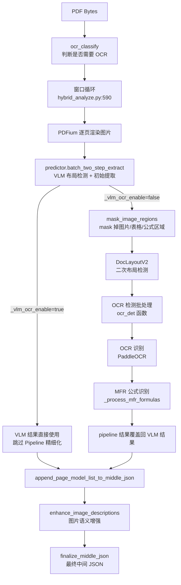

## 速答

Hybrid 后端是 Pipeline 和 VLM 的**组合策略**——用 VLM 做布局理解，用 Pipeline 的 8 种原子模型做精细化提取。核心数据流：

关键设计决策：
- **VLM OCR 判断逻辑**：`_should_enable_vlm_ocr()`（line 520-532）——仅中英文 + 行内公式 + 非强制 pipeline 时用 VLM OCR，否则走精细化
- **Batch Ratio 自适应**：`get_batch_ratio()`（line 490-517）——根据 GPU 显存自动选择批处理倍数（8GB→1x, 12GB→4x, 16GB→8x, 32GB+→16x）
- **NotExtractType**：VLM 布局会给每个 block 分类，`not_extract_list`（line 53）列出 TEXT/TITLE/HEADER 等非提取类型——这些区域需要 OCR 细提取
- **OCR 检测按分辨率分组批处理**：`ocr_det()` 函数（line 65-204）按 `target_h, target_w` 分组裁剪图片，`batch_predict()` 一次处理同分辨率的所有块

## 关键证据

1. **VLM OCR 三条件判断**：`mineru/backend/hybrid/hybrid_analyze.py:520-532` — `_should_enable_vlm_ocr()` 返回 True 当且仅当：`ocr_enable`（PDF 需要 OCR）+ `language in ["ch", "en"]` + `inline_formula_enable` + 未设置 `MINERU_HYBRID_FORCE_PIPELINE_ENABLE`。

2. **VLM OCR 路径 vs 精细化路径**：`mineru/backend/hybrid/hybrid_analyze.py:606-622` — `_vlm_ocr_enable=true` 时直接用 `predictor.batch_two_step_extract()` 结果（VLM 同时做 OCR）；`_vlm_ocr_enable=false` 则将 `not_extract_list` 传给 VLM 跳过文本提取，再调 `_process_ocr_and_formulas()` 用 pipeline 模型精细化。

3. **ocr_det 批处理优化**：`mineru/backend/hybrid/hybrid_analyze.py:65-204` — `ocr_det()` 函数双模式：非批处理模式逐块 crop→OCR（line 83-120）；批处理模式按分辨率分组（`RESOLUTION_GROUP_STRIDE=64`，line 156-166），padding 到统一尺寸后 `batch_predict()` 一次处理（line 182）。

4. **Mask 图片区域**：`mineru/backend/hybrid/hybrid_analyze.py:206-226` — `mask_image_regions()` 将 VLM 布局结果中的 IMAGE/TABLE/EQUATION 区域涂白，让后续 OCR 不在这些区域误检测文字。

5. **Batch Ratio 自适应算法**：`mineru/backend/hybrid/hybrid_analyze.py:490-517` — 根据 `get_vram(device)` 返回的 GB 值查表：≥32→16x, ≥16→8x, ≥12→4x, ≥8→2x, else→1x。VLM OCR 开启时固定为 1（避免双重大模型竞争显存，line 584）。

6. **OCR 分类判断**：`mineru/backend/hybrid/hybrid_analyze.py:55-63` — `ocr_classify()` 根据 `parse_method='auto'` 时调用 `pdf_classify()`（`mineru/utils/pdf_classify.py`）判断 PDF 是电子件还是扫描件。

7. **HybridModelSingleton**：`mineru/backend/pipeline/model_init.py:263-286` — 专门给 Hybrid 使用的模型单例，只初始化 OCR + Layout + MFR 三个原子模型，不会重复初始化表格模型（Hybrid 不做表格精细化）。

8. **窗口批处理**：Hybrid 沿用 VLM 风格的窗口处理（`hybrid_analyze.py:590-649`），但只处理单文档。窗口大小默认 64 页（`get_processing_window_size`），窗口内 VLM 一次性处理，Pipeline 精细化追加到 `middle_json`。

## 后续建议

基于这份结构，可进一步探索：
- `_process_ocr_and_formulas()` 的精细化内部流程——OCR 结果如何覆盖 VLM 输出
- `hybrid_model_output_to_middle_json.py` 的 `_post_block_process`——Hybrid 的最终后处理与 Pipeline 的差异
- `hybrid_magic_model.py`（`mineru/backend/hybrid/hybrid_magic_model.py:1-20`）——Hybrid 专用 MagicModel 的简化逻辑

## 相关文档

- `.codestable/architecture/ARCHITECTURE.md` — 系统架构总入口
- `.codestable/compound/2026-05-07-explore-pipeline-backend-internals.md` — Pipeline 后端内部结构
- `.codestable/compound/2026-05-07-explore-vlm-backend-internals.md` — VLM 后端内部结构
- `.codestable/compound/2026-05-07-explore-system-overview.md` — 全局模块划分
