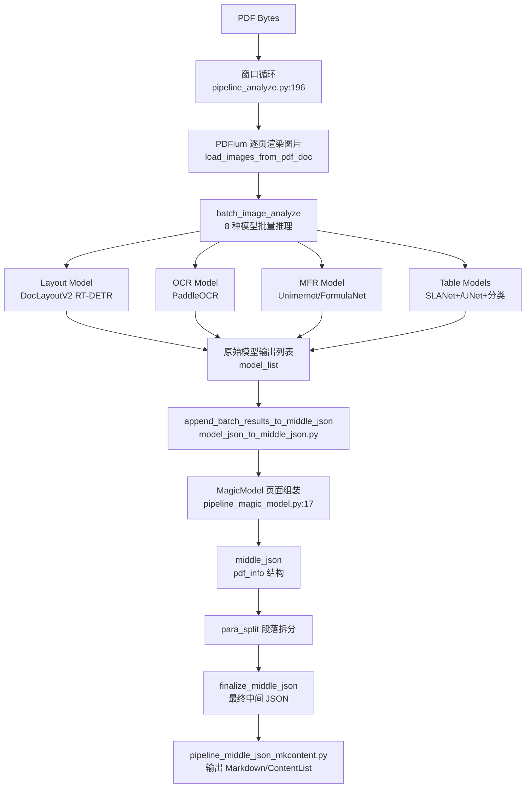

## 速答

Pipeline 后端是 MinerU 中**速度最快的解析路径**——用 8 种本地传统 ML 模型串行协作完成 PDF 页面解析。核心数据流：

关键设计决策：
- **窗口式批处理**：多文档混合编批（`window_size=64` 页），跨文档共享一次模型加载
- **原子模型注册表**：8 种模型通过 `AtomicModel` 枚举（`model_list.py:2`）和 `AtomModelSingleton`（`model_init.py:116`）统一管理
- **MagicModel 作为页面组装中枢**：接收所有模型输出和页面图片，负责 bbox 修正、span/block 层级组装、文字提取
- **中间 JSON 作为唯一输出格式**：所有后端的收束点，确保 Markdown 和 ContentList 生成逻辑后端无关

## 关键证据

1. **批处理窗口流**：`mineru/backend/pipeline/pipeline_analyze.py:196-259` — `doc_analyze_streaming()` 用 `while processed_pages < total_pages` 循环，按 `window_size` 从多个文档交叉提取页面图片，一次 `batch_image_analyze()` 调用同时处理所有窗口内页面。

2. **8 种原子模型枚举**：`mineru/backend/pipeline/model_list.py:2-10` — `AtomicModel` 类定义 Layout/MFD/MFR/OCR/WirelessTable/WiredTable/TableCls/ImgOrientationCls 八种枚举。

3. **模型单例缓存两级**：外层 `ModelSingleton`（`pipeline_analyze.py:33-58`）按 `(lang, formula_enable, table_enable)` key 缓存 `MineruPipelineModel`；内层 `AtomModelSingleton`（`model_init.py:116-155`）进一步按 `(model_name, kwargs...)` 细粒度缓存每个原子模型，实现 OCR 引擎等跨模型复用。

4. **MineruPipelineModel 组合**：`mineru/backend/pipeline/model_init.py:199-260` — `MineruPipelineModel.__init__` 按公式/表格开关条件初始化 5-8 个模型，每个通过 `AtomModelSingleton.get_atom_model()` 获取。

5. **BatchAnalyze 批处理调度**：`mineru/backend/pipeline/batch_analyze.py:36-61` — `BatchAnalyze` 类封装批处理参数（`batch_ratio`、批处理开关），基类批大小 `LAYOUT_BASE_BATCH_SIZE=1` / `MFR_BASE_BATCH_SIZE=16` / `OCR_DET_BASE_BATCH_SIZE=8`（line 29-31）。

6. **MagicModel 后处理**：`mineru/backend/pipeline/pipeline_magic_model.py:17-103` — `MagicModel.__init__` 接收 `page_model_info`（所有模型的原始输出字典），内部完成坐标修正（`__fix_axis`）、后处理重排（`__post_process`）、虚拟 block 文本提取。

7. **中间 JSON 最终化**：`mineru/backend/pipeline/model_json_to_middle_json.py:247-283` — `finalize_middle_json()` 遍历所有页面的 `pdf_info`，执行 `_post_block_process`（段落拆分/跨页合并），≥10 页时触发显存清理。

8. **Markdown 生成**：`mineru/backend/pipeline/pipeline_middle_json_mkcontent.py:18-74` — `make_blocks_to_markdown()` 按 `BlockType` 分支处理：TEXT/LIST/INDEX → `merge_para_with_text`；TITLE → 加 `#` 前缀；INTERLINE_EQUATION → 公式渲染或截图；IMAGE/TABLE/CHART → `merge_visual_blocks_to_markdown`。

## 后续建议

基于这份结构，可进一步探索：
- `BatchAnalyze` 内部 878 行的批处理逻辑（batch_analyze.py）——了解 8 种模型的批推理时序
- `para_split.py` 的段落拆分算法——list/index 块的启发式判断规则
- `model_json_to_middle_json.py` 的 `append_batch_results_to_middle_json` ——模型原始输出到中间 JSON 的转换细节

## 相关文档

- `.codestable/architecture/ARCHITECTURE.md` — 系统架构总入口
- `.codestable/compound/2026-05-07-explore-system-overview.md` — 全局模块划分
