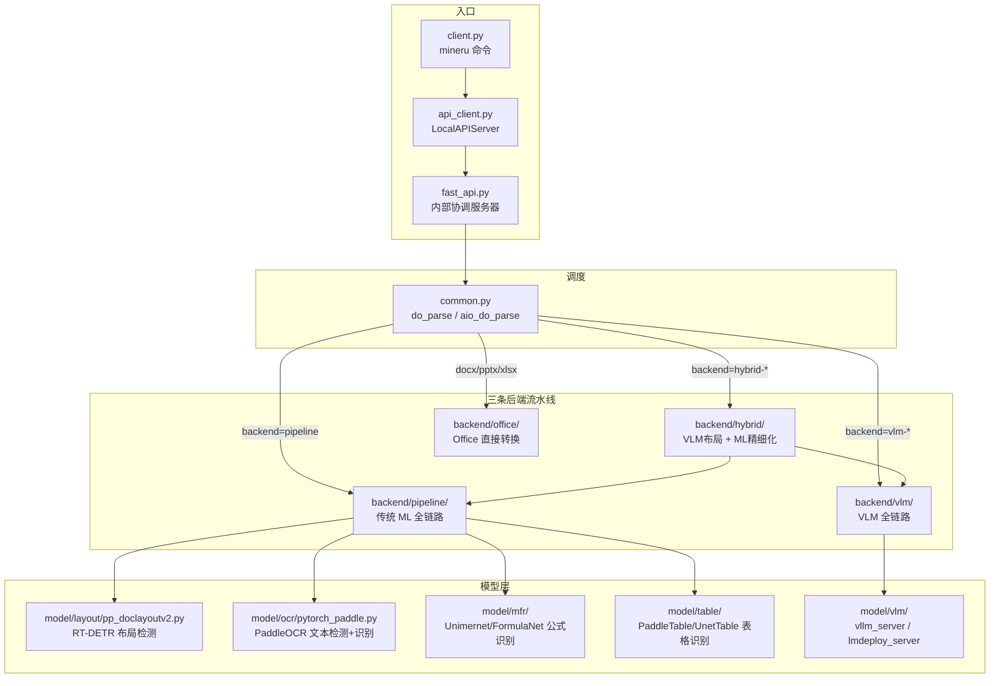

## 问题与范围

探索 MinerU 全局——文档解析工具的核心功能链（PDF/图片/Office → Markdown/JSON）。覆盖所有模块：入口层 (cli)、后端流水线 (backend)、模型层 (model)、数据 IO (data)、工具层 (utils)。

## 速答

MinerU 是一个**多后端文档解析流水线**，核心链路为：

```
用户输入 (PDF/图片/Office)
  → CLIENT 层 (client.py)
    → 本地 FastAPI 服务 (fast_api.py, 自动拉起)
      → 解析调度 (common.py: do_parse / aio_do_parse)
        → BACKEND 层 (pipeline | vlm-* | hybrid-* | office)
          → MODEL 层（布局检测 / OCR / 公式识别 / 表格识别 / VLM）
            → 中间 JSON → Markdown/ContentList 输出
```



**三条流水线差异**：
| 流水线 | 模型 | 速度 | 精度 | 场景 |
|--------|------|------|------|------|
| `pipeline` | 本地传统 ML 模型（DocLayoutV2 + PaddleOCR + MFR） | 快 | 中 | 纯 CPU/GPU 本地部署 |
| `vlm-*` | VLM（1.2B~7B 视觉语言模型） | 慢 | 高 | 仅 GPU / 远端 API |
| `hybrid-*` | VLM 做布局 + Pipeline 做细化 | 中 | 最高 | 本地 GPU（默认推荐） |

**关键模块**：
- `mineru/cli/` — 7 个入口点（client, fast_api, vlm_server, models_download 等）
- `mineru/backend/` — 4 套流水线 + 1 个工具子目录
- `mineru/model/` — 按任务划分：layout / ocr / mfr / table / vlm / ori_cls + 3 个 Office 支持
- `mineru/data/` — 读写抽象层（本地文件 / S3 / HTTP）
- `mineru/utils/` — 30+ 工具模块（PDF 处理、OCR 辅助、bbox、配置、枚举等）
- `mineru/resources/` — 语言检测模型 + HTML 模板

## 关键证据

1. **CLI → 本地服务启动**：`mineru/cli/client.py:872` — `LocalAPIServer(extra_cli_args).start()`；`api_client.py:407` — `from mineru.cli.fast_api import main` 以子进程形式启动服务。

2. **后端路由**：`mineru/cli/common.py:663-707` — `do_parse()` 按 backend 参数分发到三个处理函数：`_process_pipeline` / `_process_vlm` / `_process_hybrid`。

3. **Pipeline 模型组合**：`mineru/backend/pipeline/model_list.py:3-10` — 定义 8 种原子模型（Layout / MFD / MFR / OCR / WirelessTable / WiredTable / TableCls / ImgOrientationCls），由 `model_init.py:33-80` 初始化。

4. **Hybrid 混合流程**：`mineru/backend/hybrid/hybrid_analyze.py:710` — "Hybrid processing-window run" 日志标记；先调用 VLM 做布局 (`vlm_analyze.py:252`)，再用 pipeline 模型做 OCR/MFR 细化。

5. **入口脚本映射**：`pyproject.toml:121-126` — 7 个 CLI 脚本：`mineru` / `mineru-vllm-server` / `mineru-lmdeploy-server` / `mineru-openai-server` / `mineru-models-download` / `mineru-api`。

6. **数据 IO 抽象**：`mineru/data/data_reader_writer/base.py:6-52` — `DataReader`/`DataWriter` 抽象基类，支持文件系统 (`filebase.py`)、S3 (`s3.py`、`multi_bucket_s3.py`)、HTTP (`io/http.py`) 三种存储后端。

7. **VLM 推理引擎选择**：`mineru/utils/engine_utils.py:34` — `get_vlm_engine()` 自动选择推理引擎（vllm/lmdeploy/mlx），`mineru/cli/vlm_server.py:8-30` — 三种服务器模式复用同一函数入口。

## 细节展开

### 模块目录树

```
mineru/
├── cli/                     # 入口与协调层
│   ├── client.py            # ⭐ mineru 主命令，编排任务
│   ├── fast_api.py          # ⭐ 内部解析服务 (FastAPI + Uvicorn)
│   ├── common.py            # ⭐ 后端调度器 (do_parse / aio_do_parse)
│   ├── api_client.py        # HTTP 客户端 + 本地服务生命周期管理
│   ├── api_protocol.py      # API 协议常量（并发限制、窗口大小）
│   ├── vlm_server.py        # VLM 模型服务入口 (vllm/lmdeploy/openai-compatible)
│   ├── vlm_preload.py       # VLM 模型预加载
│   ├── models_download.py   # 模型下载 CLI
│   ├── output_paths.py      # 输出路径解析
│   ├── visualization.py     # 布局/span 可视化 (bbox 画框)
│   ├── public_http_client_policy.py  # 公网 HTTP 客户端安全策略
│   └── common.py            # 共享工具（suffix 定义、dependency 检查）
│
├── backend/                 # 解析流水线
│   ├── pipeline/            # 传统 ML 全链路 (8 模型)
│   │   ├── pipeline_analyze.py     # 流水线入口
│   │   ├── batch_analyze.py        # 批处理逻辑
│   │   ├── model_init.py           # 模型初始化 (8 种原子模型)
│   │   ├── model_list.py           # 模型枚举定义
│   │   ├── model_json_to_middle_json.py  # 原始结果 → 中间 JSON
│   │   ├── pipeline_magic_model.py # 后处理魔术模型
│   │   ├── pipeline_middle_json_mkcontent.py  # 中间 JSON → Markdown
│   │   └── para_split.py           # 段落拆分
│   ├── vlm/                 # VLM 全链路
│   │   ├── vlm_analyze.py          # VLM 入口 + ModelSingleton
│   │   ├── vlm_magic_model.py      # VLM 后处理
│   │   ├── model_output_to_middle_json.py  # VLM 输出 → 中间 JSON
│   │   ├── vlm_middle_json_mkcontent.py    # 中间 JSON → Markdown
│   │   ├── image_enhance.py        # 图片描述增强 (SiliconCloud API)
│   │   └── utils.py                # VLM 配置工具
│   ├── hybrid/              # 混合流水线 (VLM 布局 + Pipeline 细化)
│   │   ├── hybrid_analyze.py       # 混合入口
│   │   ├── hybrid_magic_model.py   # 混合后处理
│   │   └── hybrid_model_output_to_middle_json.py
│   ├── office/              # Office 文档转换
│   │   ├── docx_analyze.py         # DOCX → MD
│   │   ├── pptx_analyze.py         # PPTX → MD
│   │   ├── xlsx_analyze.py         # XLSX → MD/CSV
│   │   ├── office_magic_model.py   # Office 后处理
│   │   └── office_middle_json_mkcontent.py  # 中间 JSON → Markdown
│   └── utils/               # 后端共享工具
│       └── runtime_utils.py
│
├── model/                   # 推理模型实现
│   ├── layout/              # 布局检测: DocLayoutV2 (RT-DETR based)
│   │   └── pp_doclayoutv2.py
│   ├── ocr/                 # OCR: PaddleOCR PyTorch 移植
│   │   ├── pytorch_paddle.py
│   │   ├── seal_crop.py
│   │   └── seal_det_warp.py
│   ├── mfr/                 # 数学公式识别
│   │   ├── unimernet/       # Unimernet 模型
│   │   ├── pp_formulanet_plus_m/  # 中文公式模型
│   │   └── utils.py
│   ├── table/               # 表格识别
│   │   ├── cls/             # 表格分类 (有线/无线)
│   │   └── rec/             # 表格结构识别 (SLANet / UNet)
│   ├── vlm/                 # VLM 模型服务
│   │   ├── vllm_server.py
│   │   └── lmdeploy_server.py
│   ├── ori_cls/             # 文档方向分类
│   ├── docx/                # DOCX 解析模型
│   ├── pptx/                # PPTX 解析模型
│   ├── xlsx/                # XLSX 解析模型
│   ├── office_stream.py     # Office 流式处理
│   └── utils/               # 模型共享工具 (PaddleOCR predictor 等)
│
├── data/                    # 数据读写抽象
│   ├── data_reader_writer/  # 写入器: file / S3 / multi-bucket-S3
│   │   ├── base.py          # DataReader / DataWriter 抽象基类
│   │   ├── filebase.py      # 本地文件系统实现
│   │   ├── s3.py            # 单桶 S3 实现
│   │   ├── multi_bucket_s3.py  # 多桶 S3 实现
│   │   └── dummy.py         # 空实现 (测试用)
│   └── io/                  # 下载器: file / HTTP / S3
│       ├── base.py
│       ├── http.py
│       └── s3.py
│
├── utils/                   # 工具模块 (30+)
│   ├── bbox_utils.py        # 边界框处理
│   ├── boxbase.py           # 框体基础类
│   ├── char_utils.py        # 字符处理
│   ├── check_sys_env.py     # 系统环境检查
│   ├── cli_parser.py        # CLI 参数解析
│   ├── config_reader.py     # 配置读取
│   ├── cut_image.py         # 图片裁剪
│   ├── draw_bbox.py         # bbox 可视化 (PDF/图片)
│   ├── engine_utils.py      # VLM 推理引擎选择
│   ├── enum_class.py        # 枚举定义 (BlockType, ContentType 等)
│   ├── guess_suffix_or_lang.py  # 后缀/语言检测
│   ├── hash_utils.py        # 哈希工具
│   ├── language.py          # 语言列表
│   ├── llm_aided.py         # LLM 辅助处理
│   ├── magic_model_utils.py # 魔术模型通用工具
│   ├── model_utils.py       # 模型工具 (VRAM管理)
│   ├── models_download_utils.py  # 模型下载
│   ├── ocr_utils.py         # OCR 辅助
│   ├── os_env_config.py     # 环境变量配置
│   ├── pdf_classify.py      # PDF 分类
│   ├── pdf_image_tools.py   # PDF 图片转换
│   ├── pdf_page_id.py       # PDF 页码处理
│   ├── pdf_reader.py        # PDF 读取
│   ├── pdf_text_tool.py     # PDF 文本工具
│   ├── pdfium_guard.py      # PDFium 生命周期管理
│   ├── span_block_fix.py    # Span 块修正
│   ├── span_pre_proc.py     # Span 预处理
│   ├── table_merge.py       # 表格合并
│   └── visual_magic_model_utils.py  # 可视化后处理
│
├── resources/               # 静态资源
│   ├── fasttext-langdetect/ # 语言检测模型文件
│   └── header.html          # HTML 输出模板
│
└── version.py               # 版本号
```

## 未决问题

无。

## 后续建议

基于这份系统地图，可以进入具体 workflow：排查 bug 走 `cs-issue`，新增功能走 `cs-feat`，深度了解某个后端流水线细节走 `cs-explore question`。

## 相关文档

- `.codestable/attention.md` — 项目注意事项
- `mineru/cli/client.py` — 主 CLI 入口
- `mineru/cli/common.py` — 后端调度核心
