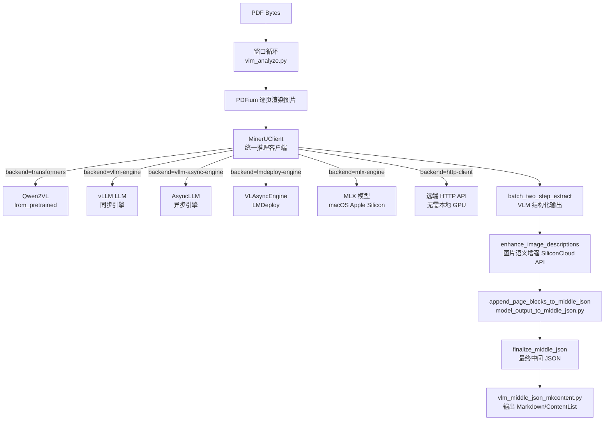

## 速答

VLM 后端用**一个大视觉语言模型**直接在单次调用中处理整个页面，不再拆分 8 种独立任务。核心数据流：

关键设计决策：
- **MinerUClient 作为推理引擎抽象**：来自 `mineru-vl-utils` 包，统一封装 6 种后端，接口一致
- **两阶段提取（two-step extract）**：第一阶段布局识别，第二阶段 OCR/公式/表格细化（或合并为单次调用）
- **ModelSingleton 线程安全缓存**：按 `(backend, model_path, server_url)` key 缓存 `MinerUClient`，模型加载是瓶颈
- **优雅关闭机制**：`atexit`（line 370）注册 `shutdown_cached_models`，遍历 `_iter_shutdown_candidates` 调用所有运行时的 close/shutdown 方法

## 关键证据

1. **ModelSingleton 多引擎适配**：`mineru/backend/vlm/vlm_analyze.py:55-253` — `ModelSingleton.get_model()` 按 `backend` 参数分支初始化不同引擎：`transformers`（Qwen2VL from_pretrained，line 83-107）、`vllm-engine`（vllm.LLM，line 119-143）、`vllm-async-engine`（AsyncLLM，line 144-175）、`lmdeploy-engine`（VLAsyncEngine，line 176-222）、`mlx-engine`（mlx_vlm，line 109-114）、`http-client`（远端 API，不需要本地初始模型）。

2. **MinerUClient 统一包装**：`mineru/backend/vlm/vlm_analyze.py:223-240` — 所有后端最终创建 `MinerUClient` 对象，传入 `backend` + 对应的引擎对象（`model`/`vllm_llm`/`vllm_async_llm`/`lmdeploy_engine`），统一配置 `enable_table_formula_eq_wrap=True`、`image_analysis=True`。

3. **MLX 串行执行守护**：`mineru/backend/vlm/vlm_analyze.py:380-398` — `_maybe_enable_serial_execution()` 检测 mlx-engine 后端时附加 `threading.Lock`，确保 MLX 模型一次只处理一个请求。`predictor_execution_guard`（line 392-398）用作上下文管理器。

4. **shutdown_cached_models 生命期管理**：`mineru/backend/vlm/vlm_analyze.py:366-370` — `atexit.register(shutdown_cached_models)` 注册进程退出清理；`_shutdown_predictor_runtime`（line 360-363）遍历引擎对象尝试 `shutdown/close/stop/terminate/destroy` 共 13 个方法链（line 327-345）。

5. **图片语义增强**：`mineru/backend/vlm/image_enhance.py` — `enhance_image_descriptions()` 用外部 SiliconCloud API 对 VLM 解析出的图片添加语义描述文本，增强输出质量。

6. **VLM 输出 → 中间 JSON**：`mineru/backend/vlm/model_output_to_middle_json.py:110` — `init_middle_json()` 标记 `_backend: "vlm"`。页面信息通过 `append_page_blocks_to_middle_json` 逐页追加，`finalize_middle_json` 做跨页表格合并等后处理。

7. **VLM Markdown 生成**：`mineru/backend/vlm/vlm_middle_json_mkcontent.py` — `union_make()` 接收 `middle_json`，按 `ContentTypeV2` 枚举（比 Pipeline 的 `ContentType` 更多类型）分支渲染 Markdown 和 ContentList。

8. **OMP_NUM_THREADS 自动配置**：`mineru/backend/vlm/vlm_analyze.py:116-117` — 非 mlx-engine 模式下自动设置 `OMP_NUM_THREADS=1`，避免 VLLM/LMDeploy 与 PyTorch 线程竞争。

## 后续建议

基于这份结构，可进一步探索：
- VLM 输出 JSON 的具体字段结构——理解 `append_page_blocks_to_middle_json` 中的数据映射
- `image_enhance.py` 的 SiliconCloud API 调用细节——了解图片增强的触发条件和格式
- `vlm_middle_json_mkcontent.py` 中 `ContentTypeV2` 各类型的渲染逻辑——理解 VLM 输出的 Markdown 格式差异

## 相关文档

- `.codestable/architecture/ARCHITECTURE.md` — 系统架构总入口
- `.codestable/compound/2026-05-07-explore-pipeline-backend-internals.md` — Pipeline 后端内部结构
- `mineru/backend/vlm/vlm_analyze.py` — VLM 后端主入口（608 行）
